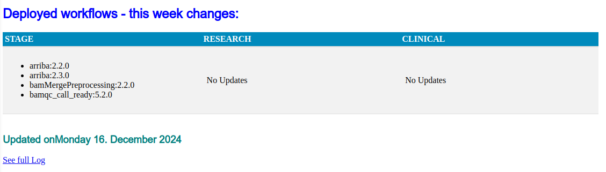

# vidarrTracker

A simple logger of workflow deployment to vidarr instances

# A two-step process

* First, we interrogate vidarr instances using curl
* Next, we generate a HTML report page with updates listed for all vidarr instances

# Running using regular intervals

The main purpose of vidarrTracker is to keep a log of deployment events so that
we could monitor and review the process of bringing new workflows into vidarr and
updates to the previously deployed workflows (version increments).

